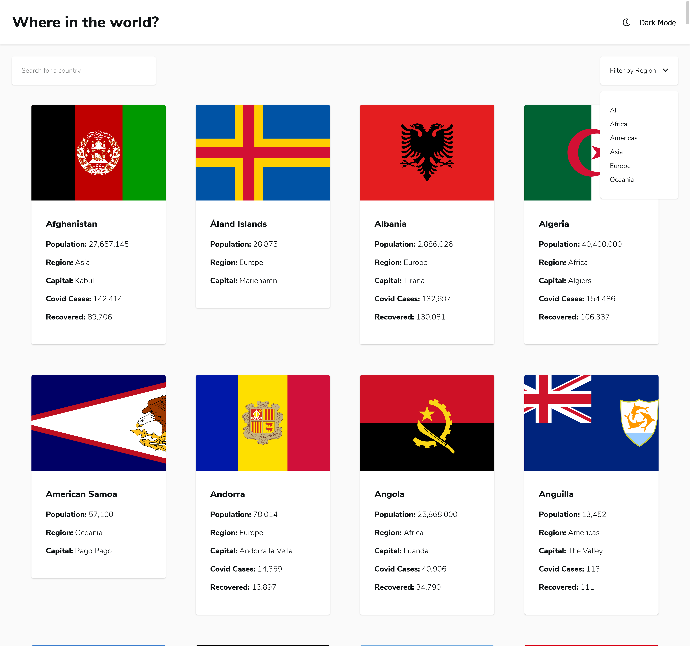
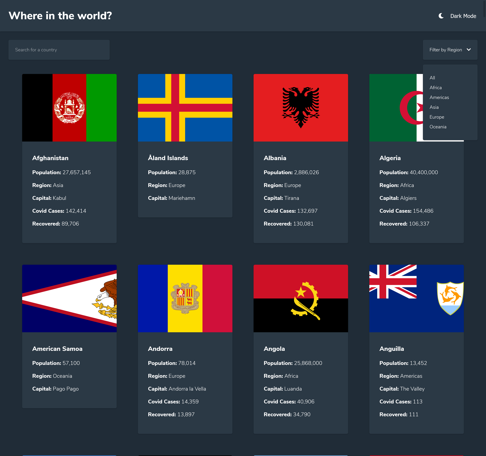
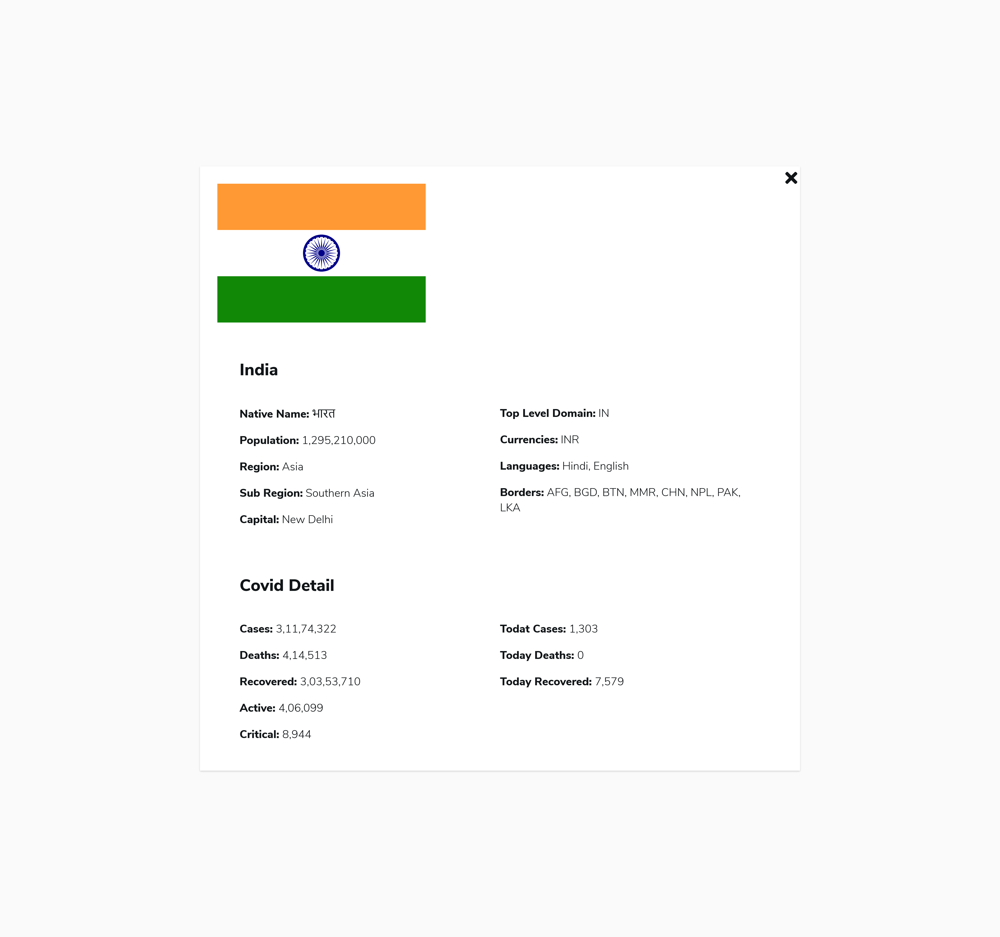
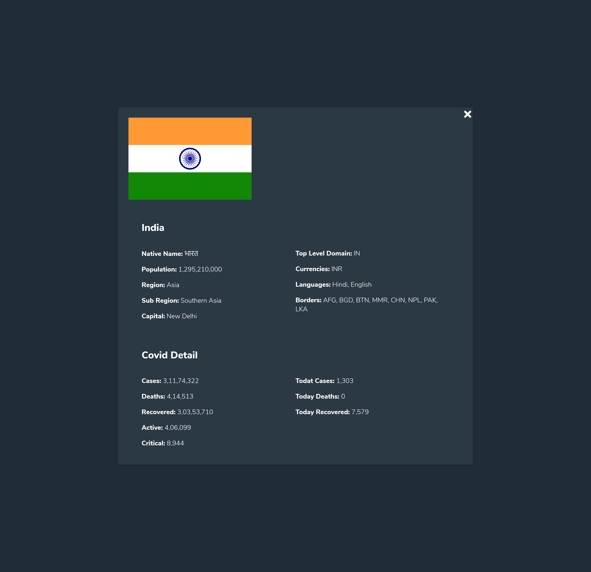
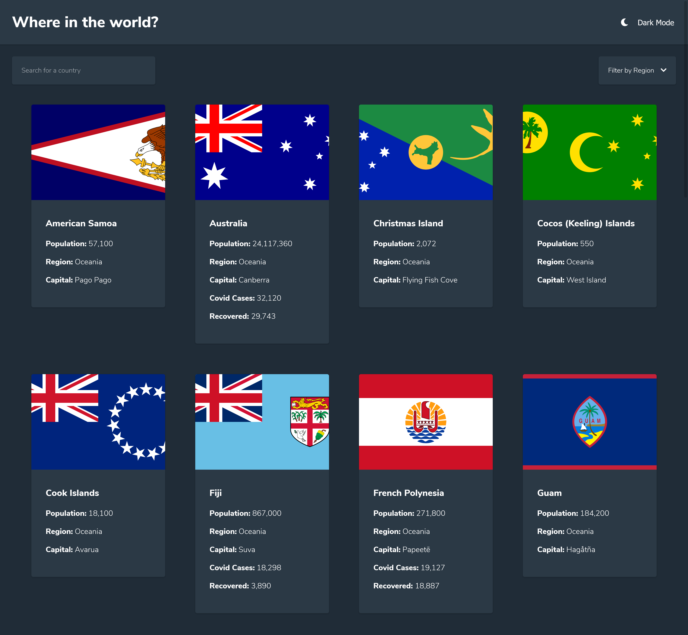
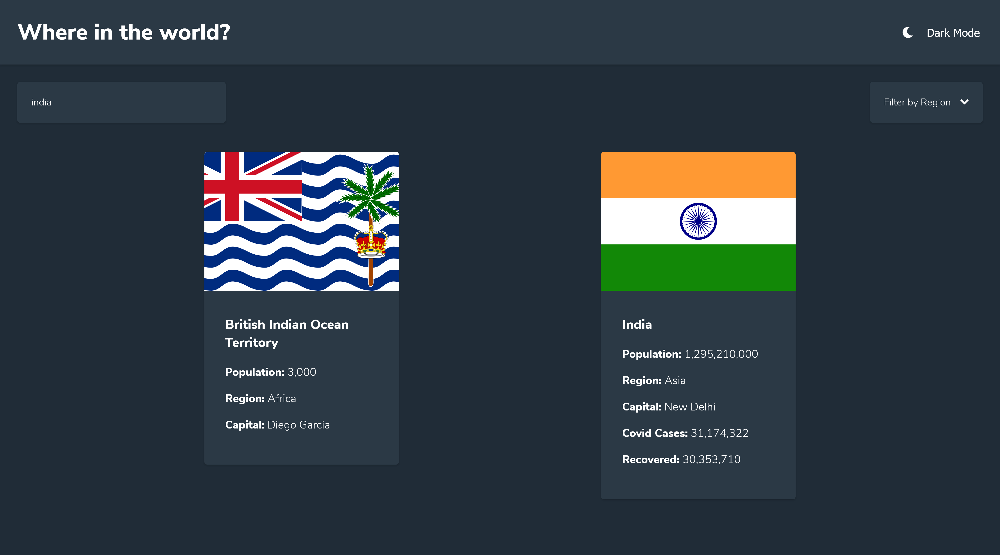
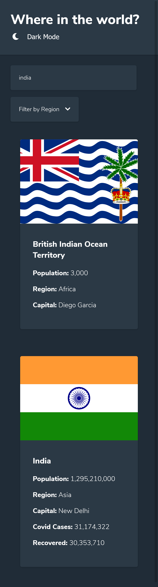
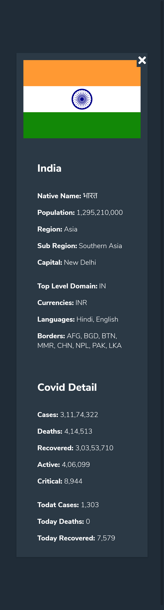

## Table of contents

- [Overview](#overview)
  - [Basic Design & Functions](#Basic-Design-&-Functions)
  - [Screenshot](#screenshot)
  - [Links](#links)
- [My process](#my-process)
  - [Built with](#built-with)
  - [V1 Country Info](#V1)
  - [V2 +Covid Update ](#V2)
  - [Useful resources](#useful-resources)
- [Author](#author)

## Overview

### Basic Design & Functions

Users should be able to:

- See all countries from the API on the homepage
- Search for a country using an `input` field
- Filter countries by region
- Click on a country to see more detailed information on a separate page
- Toggle the color scheme between light and dark mode

### Screenshot

### Links

- Solution URL: [Country Info Github](https://github.com/sunil-sharma-999/Country-Info)
- Live Site URL: [Country Info Website](https://sunil-sharma-999.github.io/Country-Info/)

## My process

### Built with

- Semantic HTML5 markup
- CSS custom properties
- Flexbox
- CSS Grid
- Desktop-first workflow
- Vanilla JS
- Fontawesome icons

### V1

- See all countries from the API on the homepage
- See all the basic information of countries on card.
  - Flag
  - Country Name
  - Country Population
  - Region
  - Capital
- Search for a country using an `input` field
- Filter countries by region
- Click on a country to see more detailed information on a separate page
- Toggle the color scheme between light and dark mode

### V2

- Update
  - added covid API
  - See basic covid information for all the countries
    - Covid Cases
    - Recovered
  - Added Covid Details Section
  - Click on the card for detailed information about Countries and Covid Details

### Useful resources

- [MDN Web Docs](https://developer.mozilla.org/en-US/)
- [CSS-TRICKS](https://css-tricks.com/)
- [StackOverflow](https://stackoverflow.com/)
- [Rest API Docs](https://restcountries.eu/)
- [Open Disease Data API](https://corona.lmao.ninja/)

## Author

- GitHub - [Sunil Sharma](https://github.com/sunil-sharma-999/)
